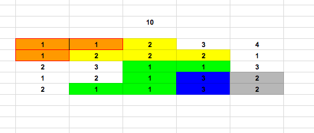

## 10

### Background

10 is a single-player sliding block puzzle game inspired by 1024. The blocks follow the following rules: 

1) Each block is assigned a initial value from 1 to 4 
2) Only block in a cluster(has shared border with block of the same value) would be able to be removed
3) The cluster of the block would be removed all together and replaced by one block with the value as the original value plus 1 
4) The goal is to generate a block with value 10 in a limited number of moves  

### Functionality & MVP  

- [ ] Description of the rule of the game 
- [ ] The board is consisted of a 5*5 grid with randomized number 

Users will be able to 
- [ ] start and reset the game board 
- [ ] select the block and remove the block with its qualified adjacent blocks  

In addition 
- [ ] The board would be remapped with the newly generated block and other randomized blocks to fill the gap of the removed blocks
- [ ] A production READme 

### Wireframes 

### Architecture and Technologies
The project will be implemented with the following technologies: 

- Vanilla JavaScript and `jquery` for overall structure and game logic,
- Webpack to bundle and serve up the various scripts.

### Implementation Timeline

**Day 1**:

- Set up the environment and build the board object. The goal is to render the grid 

**Day 2**:

- Complete the cell module and make the cell clickable on the screen 

**Day 3**:

- Create the logic backend. Enable the grid to search for blocks qualified for removal and redraw new blocks 

**Day 4**:

- Style the frontend and create control for users to restart the game 

### Bonus features

- [ ] Add options for different difficulty level 
