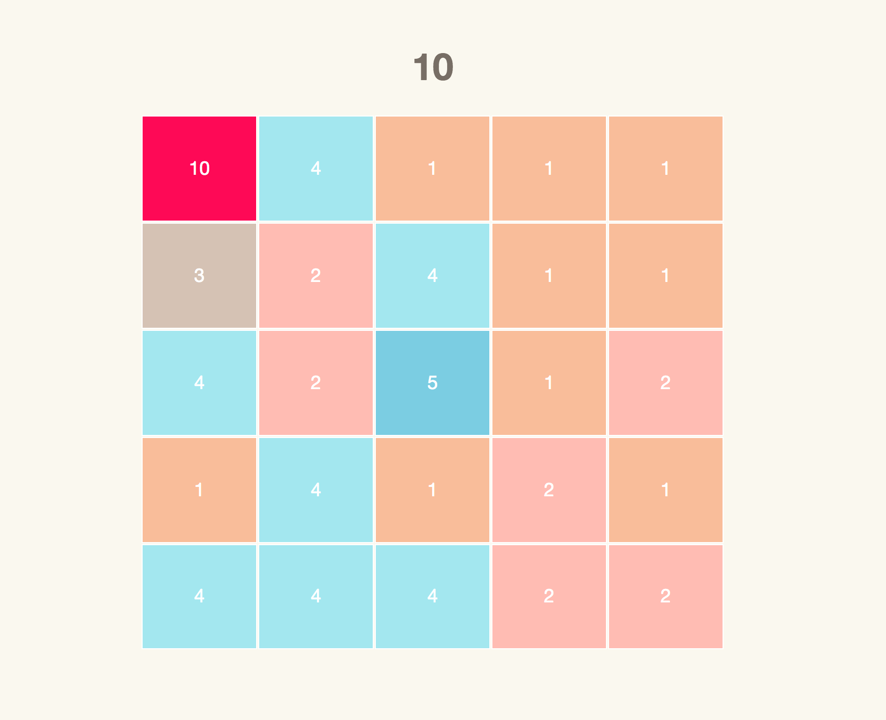

## 10

[10 live](https://wenyuanwu.github.io/10/)



### Background & Functionality 

10 is a single-player sliding cell puzzle game in the honor of the lengendary [2048](https://gabrielecirulli.github.io/2048/). The game follows the following rules: 

1) The game starts with a fully filled board which is consisted of 25 cells. Each cell is assigned a initial value from 1 to 4 

2) Only cell in a cluster (has adjacent cell with the same value) would be able to be removed through the click. The adjacency is defined as the existence of any shared border 

3) After the click, the cluster of the cells would be removed all together. A new cell with the orginal value plus one would be created and placed on the same row of the cell be clicked. All the existing cells would be shifted towards the left and new random cells would be generated on the right to fill the unoccupied space   

4) The cluster of the block would be removed all together and replaced by one block with the value as the original value plus 1 

### Implementation  

#### Gameboard layout 

A GameView object is created to translate javascript object into html element. 
The Gameboard is consisted of a html 5*5 table and 25 html cell element.  
By using JQuery, the addTile function within GameView is able to identify the table cell and the cell object which shared the same x, y coordinate, turn the cell object into html element and wrap it by the table li element: 
```
GameView.prototype.setupBoard = function(){

	for(let rowIdx = 0; rowIdx < this.size; rowIdx ++){
		const $ul = $("<ul>");
		$ul.addClass("group");
		for(let colIdx = 0; colIdx < this.size; colIdx ++){
			var li = document.createElement("li");
			li.setAttribute("class",rowIdx + "-" + colIdx);
			let $li = $(li);
			$li.data("pos", [rowIdx, colIdx]);
			$ul.append($li);	
		}	
		this.$el.append($ul);
		}	
};
``` 
```
GameView.prototype.addTile = function(block){	
	var inner = document.createElement("div");
	inner.textContent = block.value;
	var className = "tile " + "tile-position-"+ block.x + "-" + block.y + " value-" + block.value;
	this.applyClass(inner,className);
	var li = document.getElementsByClassName(block.x + "-" + block.y)[0];	
	li.setAttribute("id", block.value);
	$(li).empty();
	$(li).wrapInner(inner);
};
```

#### Random cells generation 

#### Recognition of cell cluster 

### Future Features  

- Add demo to showcase the process of cells removal and the rules to generate new cells 
- Add score section to the current page 
- Optimize cell generation process 
- Make the game compatible to mobile screen 
- Add an AI player 